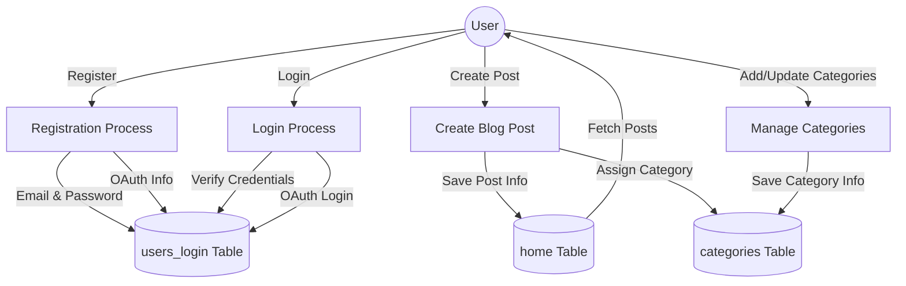

```mermaid
graph TD
    %% External Entity (User)
    User((User))
    
    %% Processes
    ProcessLogin[Login Process]
    ProcessRegister[Registration Process]
    ProcessCreatePost[Create Blog Post]
    ProcessManageCategories[Manage Categories]
    
    %% Data Stores (Tables)
    DS1[(users_login Table)]
    DS2[(home Table)]
    DS3[(categories Table)]
    
    %% Data Flow for Registration
    User -->|Register| ProcessRegister
    ProcessRegister -->|Email & Password| DS1
    ProcessRegister -->|OAuth Info| DS1

    %% Data Flow for Login
    User -->|Login| ProcessLogin
    ProcessLogin -->|Verify Credentials| DS1
    ProcessLogin -->|OAuth Login| DS1
    
    %% Data Flow for Creating Blog Posts
    User -->|Create Post| ProcessCreatePost
    ProcessCreatePost -->|Save Post Info| DS2
    ProcessCreatePost -->|Assign Category| DS3
    DS2 -->|Fetch Posts| User

    %% Data Flow for Managing Categories
    User -->|Add/Update Categories| ProcessManageCategories
    ProcessManageCategories -->|Save Category Info| DS3

```